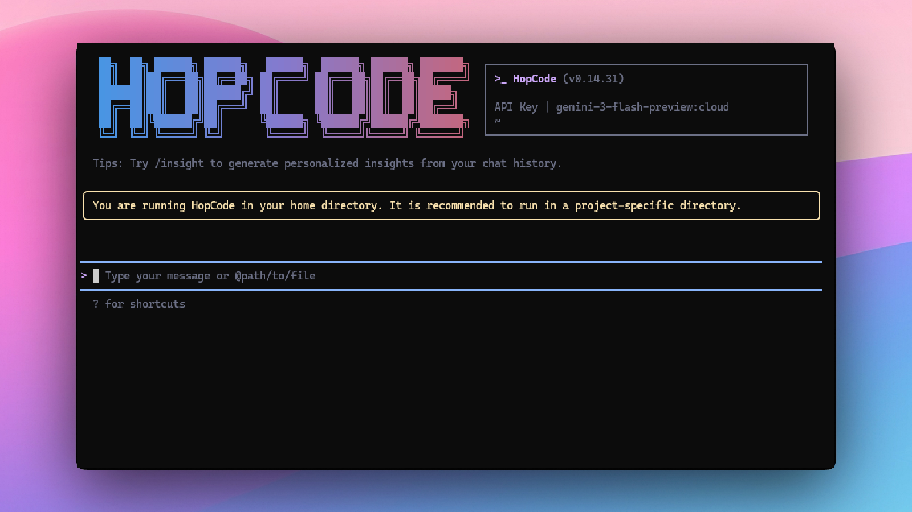

<div align="center">

[](https://www.npmjs.com/package/@hoptrendy/hopcode-cli)
[](./LICENSE)
[](https://nodejs.org/)
[](https://marketplace.visualstudio.com/items?itemName=hopcode.hopcode-vscode-ide-companion)
[](https://www.npmjs.com/package/@hoptrendy/hopcode-cli)

**An open-source AI agent that lives in your terminal — works with any model provider.**

<a href="https://hopcode.dev/docs/zh/users/overview">中文</a> |
<a href="https://hopcode.dev/docs/de/users/overview">Deutsch</a> |
<a href="https://hopcode.dev/docs/fr/users/overview">français</a> |
<a href="https://hopcode.dev/docs/ja/users/overview">日本語</a> |
<a href="https://hopcode.dev/docs/ru/users/overview">Русский</a> |
<a href="https://hopcode.dev/docs/pt-BR/users/overview">Português (Brasil)</a>

</div>

## 🎉 News

- **2026-04-19**: 🎸 **VS Code Extension v0.14.8** published to the [VS Code Marketplace](https://marketplace.visualstudio.com/items?itemName=hopcode.hopcode-vscode-ide-companion). Install directly from VS Code!

- **2026-04-19**: ✨ **Skills System** launched — 5 built-in skills (`spec-driven`, `git-workflow`, `codebase-map`, `changelog`, `mcp-builder`). Run `hopcode skills list` to see them.

- **2026-04-15**: Qwen OAuth provider has been discontinued. Switch to [OpenRouter](https://openrouter.ai), [Fireworks AI](https://app.fireworks.ai), any compatible API provider, or run models locally via Ollama. Run `hopcode auth` to configure.

## Why HopCode?

HopCode is an open-source AI agent for the terminal that works with **any LLM provider** — cloud or local. It helps you understand large codebases, automate tedious work, and ship faster.

- **Any provider, any model**: OpenAI, Anthropic, Google Gemini, Mistral, DeepSeek, Groq, Together AI, Fireworks AI, Cohere, xAI Grok, [OpenRouter](https://openrouter.ai) (100+ models), [Ollama](https://ollama.com) / [vLLM](https://vllm.ai) (local), and any OpenAI-compatible endpoint. **15+ native provider SDKs** — more deep integrations than any competitor.
- **Skills system**: modular, auto-loaded skills extend HopCode's capabilities — run `hopcode skills list` to see bundled skills or add your own.
- **Agentic workflow, feature-rich**: built-in tools for file editing, shell execution, web search, sub-agents, and full agentic loops — a Claude Code-like experience.
- **VS Code extension**: **the only terminal AI agent with a native VS Code Marketplace extension** — install directly from VS Code for in-editor AI assistance. No JSON-RPC setup required.
- **Terminal-first, IDE-friendly**: built for developers who live in the command line, with optional integration for VS Code, Zed, and JetBrains IDEs. Plus a **web dashboard** for browser-based workflows.
- **🏟️ Arena mode** _(unique)_: run multiple AI models in parallel on the same task and compare outputs side-by-side. No other terminal agent has this.
- **📊 Per-subagent `/stats`**: track token usage, latency, and cost broken down by subagent — see exactly what each agent spent.
- **🔍 LSP integration**: native Language Server Protocol support for deep code intelligence — symbol navigation, hover info, and diagnostics powered by your language server.
- **💬 Enterprise channels**: WeChat and DingTalk integration for teams using Chinese enterprise platforms.
- **🌐 Multi-language docs**: documentation in 7 languages (EN, ZH, DE, FR, JA, RU, PT-BR).



## 🏟️ Arena Mode — Unique to HopCode

Run **multiple AI models simultaneously** on the same prompt and compare their responses side-by-side. Use Arena mode to find the best model for any task without switching context.

```bash
# Start Arena mode with 3 models competing
hopcode --arena gpt-4o,claude-sonnet-4-5,deepseek-r1 "Refactor this function for readability"
```

Arena mode spawns parallel subagents — each using a different model — and streams their responses in synchronized columns. Use `/stats` to see per-subagent token usage and latency breakdown.

> No competitor — not **Hermes Agent**, **OpenClaude**, **Claude Code**, or **Cursor** — offers multi-model parallel competition. Arena Mode is HopCode's exclusive superpower.
>
> **HopCode is also the only terminal agent with:** a native VS Code Marketplace extension, LSP integration, a browser-based web dashboard, and 15+ native AI SDK provider integrations.

## Installation

### VS Code Extension

Install the HopCode companion directly from VS Code:

1. Open VS Code → Extensions (`Ctrl+Shift+X`)
2. Search for **HopCode**
3. Click **Install**

Or install via the [VS Code Marketplace](https://marketplace.visualstudio.com/items?itemName=hopcode.hopcode-vscode-ide-companion).

### Quick Install (CLI — Recommended)

#### Linux / macOS

```bash
bash -c "$(curl -fsSL https://hopcode-assets.example.com/installation/install-hopcode.sh)"
```

#### Windows (Run as Administrator)

Works in both Command Prompt and PowerShell:

```cmd
powershell -Command "Invoke-WebRequest 'https://hopcode-assets.example.com/installation/install-hopcode.bat' -OutFile (Join-Path $env:TEMP 'install-hopcode.bat'); & (Join-Path $env:TEMP 'install-hopcode.bat')"
```

> **Note**: It's recommended to restart your terminal after installation to ensure environment variables take effect.

### Manual Installation

#### Prerequisites

Make sure you have Node.js 20 or later installed. Download it from [nodejs.org](https://nodejs.org/en/download).

#### NPM

```bash
npm install -g @hopcode/hopcode@latest
```

#### Homebrew (macOS, Linux)

```bash
brew install hopcode
```

## Quick Start

```bash
# Start HopCode (interactive)
hopcode

# Then, in the session:
/help
/auth
```

On first use, you'll be prompted to sign in. You can run `/auth` anytime to switch authentication methods.

Example prompts:

```text
What does this project do?
Explain the codebase structure.
Help me refactor this function.
Generate unit tests for this module.
```

<details>
<summary>Click to watch a demo video</summary>

<video src="https://cloud.video.taobao.com/vod/HLfyppnCHplRV9Qhz2xSqeazHeRzYtG-EYJnHAqtzkQ.mp4" controls>
Your browser does not support the video tag.
</video>

</details>

## 🦞 Use HopCode for Coding Tasks in Claw

Copy the prompt below and paste it into your agent:

```
Use HopCode as a coding agent. First, fetch and read this skill reference:
https://raw.githubusercontent.com/TaimoorSiddiquiOfficial/HopCode/refs/heads/main/.hopcode/skills/hopcode-claw/SKILL.md
Then follow the instructions inside to install, authenticate, and use HopCode via acpx for all coding tasks.
```

## Authentication

HopCode works with **any model provider** that exposes an OpenAI-compatible API, plus native Anthropic and Google Gemini protocols.

### Supported Providers

| Provider                                               | Protocol    | Notes                               |
| ------------------------------------------------------ | ----------- | ----------------------------------- |
| [OpenAI](https://platform.openai.com)                  | `openai`    | GPT-4o, GPT-4.1, o3, etc.           |
| [Anthropic](https://anthropic.com)                     | `anthropic` | Claude Opus/Sonnet/Haiku            |
| [Google Gemini](https://ai.google.dev)                 | `gemini`    | Gemini 2.5 Pro/Flash                |
| [Google Vertex AI](https://cloud.google.com/vertex-ai) | `vertex-ai` | Enterprise Gemini                   |
| [DeepSeek](https://platform.deepseek.com)              | `openai`    | deepseek-chat, deepseek-reasoner    |
| [Mistral](https://mistral.ai)                          | `openai`    | mistral-large, codestral, etc.      |
| [Groq](https://groq.com)                               | `openai`    | Llama 4, Mixtral, Qwen (ultra-fast) |
| [Together AI](https://together.ai)                     | `openai`    | 200+ open-source models             |
| [Fireworks AI](https://fireworks.ai)                   | `openai`    | DeepSeek R1/V3, Llama 4             |
| [OpenRouter](https://openrouter.ai)                    | `openai`    | 300+ models, single API key         |
| [xAI Grok](https://x.ai)                               | `openai`    | grok-4, grok-3                      |
| [Cohere](https://cohere.com)                           | `openai`    | Command-A, Command-R                |
| [Alibaba Qwen](https://dashscope.aliyuncs.com)         | `openai`    | qwen3.6-plus, qwen-max              |
| [Ollama](https://ollama.com)                           | `openai`    | Local models (llama3, qwen3, etc.)  |
| [vLLM](https://vllm.ai)                                | `openai`    | Self-hosted models                  |
| [LM Studio](https://lmstudio.ai)                       | `openai`    | Local GUI + API                     |
| Any OpenAI-compatible                                  | `openai`    | Set `baseUrl` to your endpoint      |

HopCode supports the following authentication methods:

- **API Key (recommended)**: use an API key from any supported provider (OpenAI, Anthropic, Google GenAI, Mistral, Groq, DeepSeek, OpenRouter, and any OpenAI-compatible endpoint).
- **Coding Plan**: subscribe to the Alibaba Cloud Coding Plan ([Beijing](https://bailian.console.aliyun.com/cn-beijing?tab=coding-plan#/efm/coding-plan-index) / [intl](https://modelstudio.console.alibabacloud.com/?tab=coding-plan#/efm/coding-plan-index)) for a fixed monthly fee with higher quotas.

> ⚠️ **Qwen OAuth was discontinued on April 15, 2026.** If you were previously using Qwen OAuth, please switch to one of the methods above. Run `hopcode` and then `/auth` to reconfigure.

#### API Key (recommended)

Use an API key to connect to any supported provider. Supports multiple protocols:

- **OpenAI-compatible**: OpenAI, OpenRouter, Groq, Fireworks AI, Together AI, DeepSeek, Mistral, Alibaba Qwen, Ollama, vLLM, and any `/v1`-compatible endpoint
- **Anthropic**: Claude models directly
- **Google GenAI / Vertex AI**: Gemini models

The **recommended** way to configure models and providers is by editing `~/.hopcode/settings.json` (create it if it doesn't exist). This file lets you define all available models, API keys, and default settings in one place.

##### Quick Setup in 3 Steps

**Step 1:** Create or edit `~/.hopcode/settings.json`

Here is a complete example using [OpenRouter](https://openrouter.ai) (gives you access to 300+ models with a single API key):

```json
{
  "modelProviders": {
    "openai": [
      {
        "id": "anthropic/claude-sonnet-4-5",
        "name": "Claude Sonnet 4.5 (OpenRouter)",
        "baseUrl": "https://openrouter.ai/api/v1",
        "description": "Claude via OpenRouter",
        "envKey": "OPENROUTER_API_KEY"
      },
      {
        "id": "deepseek/deepseek-r1",
        "name": "DeepSeek R1 (OpenRouter)",
        "baseUrl": "https://openrouter.ai/api/v1",
        "description": "DeepSeek R1 reasoning model",
        "envKey": "OPENROUTER_API_KEY"
      },
      {
        "id": "qwen/qwen3-coder",
        "name": "Qwen3 Coder (OpenRouter)",
        "baseUrl": "https://openrouter.ai/api/v1",
        "description": "Qwen3 Coder via OpenRouter",
        "envKey": "OPENROUTER_API_KEY"
      }
    ]
  },
  "env": {
    "OPENROUTER_API_KEY": "sk-or-xxxxxxxxxxxxx"
  },
  "security": {
    "auth": {
      "selectedType": "openai"
    }
  },
  "model": {
    "name": "anthropic/claude-sonnet-4-5"
  }
}
```

**Step 2:** Understand each field

| Field                        | What it does                                                                                                                          |
| ---------------------------- | ------------------------------------------------------------------------------------------------------------------------------------- |
| `modelProviders`             | Declares which models are available and how to connect to them. Keys like `openai`, `anthropic`, `gemini` represent the API protocol. |
| `modelProviders[].id`        | The model ID sent to the API (e.g. `qwen3.6-plus`, `gpt-4o`).                                                                         |
| `modelProviders[].envKey`    | The name of the environment variable that holds your API key.                                                                         |
| `modelProviders[].baseUrl`   | The API endpoint URL (required for non-default endpoints).                                                                            |
| `env`                        | A fallback place to store API keys (lowest priority; prefer `.env` files or `export` for sensitive keys).                             |
| `security.auth.selectedType` | The protocol to use on startup (`openai`, `anthropic`, `gemini`, `vertex-ai`).                                                        |
| `model.name`                 | The default model to use when HopCode starts.                                                                                         |

**Step 3:** Start HopCode — your configuration takes effect automatically:

```bash
hopcode
```

Use the `/model` command at any time to switch between all configured models.

##### More Examples

<details>
<summary>Coding Plan (Alibaba Cloud ModelStudio) — fixed monthly fee, higher quotas</summary>

```json
{
  "modelProviders": {
    "openai": [
      {
        "id": "qwen3.6-plus",
        "name": "qwen3.6-plus (Coding Plan)",
        "baseUrl": "https://coding.dashscope.aliyuncs.com/v1",
        "description": "qwen3.6-plus from ModelStudio Coding Plan",
        "envKey": "BAILIAN_CODING_PLAN_API_KEY"
      },
      {
        "id": "qwen3.5-plus",
        "name": "qwen3.5-plus (Coding Plan)",
        "baseUrl": "https://coding.dashscope.aliyuncs.com/v1",
        "description": "qwen3.5-plus with thinking enabled from ModelStudio Coding Plan",
        "envKey": "BAILIAN_CODING_PLAN_API_KEY",
        "generationConfig": {
          "extra_body": {
            "enable_thinking": true
          }
        }
      },
      {
        "id": "glm-4.7",
        "name": "glm-4.7 (Coding Plan)",
        "baseUrl": "https://coding.dashscope.aliyuncs.com/v1",
        "description": "glm-4.7 with thinking enabled from ModelStudio Coding Plan",
        "envKey": "BAILIAN_CODING_PLAN_API_KEY",
        "generationConfig": {
          "extra_body": {
            "enable_thinking": true
          }
        }
      },
      {
        "id": "kimi-k2.5",
        "name": "kimi-k2.5 (Coding Plan)",
        "baseUrl": "https://coding.dashscope.aliyuncs.com/v1",
        "description": "kimi-k2.5 with thinking enabled from ModelStudio Coding Plan",
        "envKey": "BAILIAN_CODING_PLAN_API_KEY",
        "generationConfig": {
          "extra_body": {
            "enable_thinking": true
          }
        }
      }
    ]
  },
  "env": {
    "BAILIAN_CODING_PLAN_API_KEY": "sk-xxxxxxxxxxxxx"
  },
  "security": {
    "auth": {
      "selectedType": "openai"
    }
  },
  "model": {
    "name": "qwen3.6-plus"
  }
}
```

> Subscribe to the Coding Plan and get your API key at [Alibaba Cloud ModelStudio(Beijing)](https://bailian.console.aliyun.com/cn-beijing?tab=coding-plan#/efm/coding-plan-index) or [Alibaba Cloud ModelStudio(intl)](https://modelstudio.console.alibabacloud.com/?tab=coding-plan#/efm/coding-plan-index).

</details>

<details>
<summary>Multiple providers (OpenAI + Anthropic + Gemini)</summary>

```json
{
  "modelProviders": {
    "openai": [
      {
        "id": "gpt-4o",
        "name": "GPT-4o",
        "envKey": "OPENAI_API_KEY",
        "baseUrl": "https://api.openai.com/v1"
      }
    ],
    "anthropic": [
      {
        "id": "claude-sonnet-4-20250514",
        "name": "Claude Sonnet 4",
        "envKey": "ANTHROPIC_API_KEY"
      }
    ],
    "gemini": [
      {
        "id": "gemini-2.5-pro",
        "name": "Gemini 2.5 Pro",
        "envKey": "GEMINI_API_KEY"
      }
    ]
  },
  "env": {
    "OPENAI_API_KEY": "sk-xxxxxxxxxxxxx",
    "ANTHROPIC_API_KEY": "sk-ant-xxxxxxxxxxxxx",
    "GEMINI_API_KEY": "AIzaxxxxxxxxxxxxx"
  },
  "security": {
    "auth": {
      "selectedType": "openai"
    }
  },
  "model": {
    "name": "gpt-4o"
  }
}
```

</details>

<details>
<summary>Enable thinking mode (for supported models like qwen3.5-plus)</summary>

```json
{
  "modelProviders": {
    "openai": [
      {
        "id": "qwen3.5-plus",
        "name": "qwen3.5-plus (thinking)",
        "envKey": "DASHSCOPE_API_KEY",
        "baseUrl": "https://dashscope.aliyuncs.com/compatible-mode/v1",
        "generationConfig": {
          "extra_body": {
            "enable_thinking": true
          }
        }
      }
    ]
  },
  "env": {
    "DASHSCOPE_API_KEY": "sk-xxxxxxxxxxxxx"
  },
  "security": {
    "auth": {
      "selectedType": "openai"
    }
  },
  "model": {
    "name": "qwen3.5-plus"
  }
}
```

</details>

> **Tip:** You can also set API keys via `export` in your shell or `.env` files, which take higher priority than `settings.json` → `env`. See the [authentication guide](https://hopcode.dev/docs/en/users/configuration/auth/) for full details.

> **Security note:** Never commit API keys to version control. The `~/.hopcode/settings.json` file is in your home directory and should stay private.

#### Local Model Setup (Ollama / vLLM / LM Studio)

You can also run models locally — no API key or cloud account needed. Configure your local model endpoint in `~/.hopcode/settings.json` using the `modelProviders` field.

<details>
<summary>Ollama setup (multiple models)</summary>

1. Install Ollama from [ollama.com](https://ollama.com/)
2. Pull models: `ollama pull qwen3:32b && ollama pull llama3.3:70b && ollama pull deepseek-r1:14b`
3. Configure `~/.hopcode/settings.json` — list all your pulled models so you can switch with `/model`:

```json
{
  "modelProviders": {
    "openai": [
      {
        "id": "qwen3:32b",
        "name": "Qwen3 32B (Ollama)",
        "baseUrl": "http://localhost:11434/v1",
        "description": "Qwen3 32B running locally"
      },
      {
        "id": "llama3.3:70b",
        "name": "Llama 3.3 70B (Ollama)",
        "baseUrl": "http://localhost:11434/v1",
        "description": "Meta Llama 3.3 70B"
      },
      {
        "id": "deepseek-r1:14b",
        "name": "DeepSeek R1 14B (Ollama)",
        "baseUrl": "http://localhost:11434/v1",
        "description": "DeepSeek R1 reasoning model"
      }
    ]
  },
  "security": {
    "auth": {
      "selectedType": "openai"
    }
  },
  "model": {
    "name": "qwen3:32b"
  }
}
```

Use `/model` inside HopCode to switch between models from the same Ollama instance.

</details>

<details>
<summary>vLLM setup</summary>

1. Install vLLM: `pip install vllm`
2. Start the server: `vllm serve Qwen/Qwen3-32B`
3. Configure `~/.hopcode/settings.json`:

```json
{
  "modelProviders": {
    "openai": [
      {
        "id": "Qwen/Qwen3-32B",
        "name": "Qwen3 32B (vLLM)",
        "baseUrl": "http://localhost:8000/v1",
        "description": "Qwen3 32B running locally via vLLM"
      }
    ]
  },
  "security": {
    "auth": {
      "selectedType": "openai"
    }
  },
  "model": {
    "name": "Qwen/Qwen3-32B"
  }
}
```

</details>

## Usage

As an open-source terminal agent, you can use HopCode in four primary ways:

1. Interactive mode (terminal UI)
2. Headless mode (scripts, CI)
3. IDE integration (VS Code, Zed)
4. TypeScript SDK

#### Interactive mode

```bash
cd your-project/
hopcode
```

Run `hopcode` in your project folder to launch the interactive terminal UI. Use `@` to reference local files (for example `@src/main.ts`).

#### Headless mode

```bash
cd your-project/
hopcode -p "your question"
```

Use `-p` to run HopCode without the interactive UI—ideal for scripts, automation, and CI/CD. Learn more: [Headless mode](https://hopcode.dev/docs/en/users/features/headless).

#### IDE integration

Use HopCode inside your editor (VS Code, Zed, and JetBrains IDEs):

- [Use in VS Code](https://hopcode.dev/docs/en/users/integration-vscode/)
- [Use in Zed](https://hopcode.dev/docs/en/users/integration-zed/)
- [Use in JetBrains IDEs](https://hopcode.dev/docs/en/users/integration-jetbrains/)

#### TypeScript SDK

Build on top of HopCode with the TypeScript SDK:

- [Use the HopCode SDK](./packages/sdk-typescript/README.md)

#### Skills

Skills are modular instruction sets that extend HopCode's capabilities for specific workflows.

```bash
# List available skills
hopcode skills list

# Show a skill's instructions
hopcode skills show spec-driven

# Add a custom skill from a URL
hopcode skills add https://example.com/my-skill/SKILL.md

# Remove a skill
hopcode skills remove my-skill
```

**Built-in skills:**

| Skill          | Description                                |
| -------------- | ------------------------------------------ |
| `spec-driven`  | TDD / spec-first development workflow      |
| `git-workflow` | Conventional commits, PR descriptions      |
| `codebase-map` | Document your codebase architecture        |
| `changelog`    | Generate structured CHANGELOG entries      |
| `mcp-builder`  | Build MCP (Model Context Protocol) servers |

## Commands & Shortcuts

### CLI Profile Commands

Save and switch provider/model configurations as named profiles:

```bash
hopcode profile init "fast-local"   # interactive wizard — sets provider, model, base URL, API key
hopcode profile list                 # list all saved profiles
hopcode profile use "fast-local"     # activate a profile for next startup
hopcode profile show                 # show currently active profile
hopcode profile delete "fast-local"  # remove a profile
```

Profiles are stored in `~/.hopcode-profiles.json` and persist across sessions.

### Session Commands

- `/help` - Display available commands
- `/clear` - Clear conversation history
- `/compress` - Compress history to save tokens
- `/stats` - Show current session information
- `/bug` - Submit a bug report
- `/exit` or `/quit` - Exit HopCode

### Keyboard Shortcuts

- `Ctrl+C` - Cancel current operation
- `Ctrl+D` - Exit (on empty line)
- `Up/Down` - Navigate command history

> Learn more about [Commands](https://hopcode.dev/docs/en/users/features/commands/)
>
> **Tip**: In YOLO mode (`--yolo`), vision switching happens automatically without prompts when images are detected. Learn more about [Approval Mode](https://hopcode.dev/docs/en/users/features/approval-mode/)

## Configuration

HopCode can be configured via `settings.json`, environment variables, and CLI flags.

| File                       | Scope         | Description                                                                           |
| -------------------------- | ------------- | ------------------------------------------------------------------------------------- |
| `~/.hopcode/settings.json` | User (global) | Applies to all your HopCode sessions. **Recommended for `modelProviders` and `env`.** |
| `.hopcode/settings.json`   | Project       | Applies only when running HopCode in this project. Overrides user settings.           |

The most commonly used top-level fields in `settings.json`:

| Field                        | Description                                                                                          |
| ---------------------------- | ---------------------------------------------------------------------------------------------------- |
| `modelProviders`             | Define available models per protocol (`openai`, `anthropic`, `gemini`, `vertex-ai`).                 |
| `env`                        | Fallback environment variables (e.g. API keys). Lower priority than shell `export` and `.env` files. |
| `security.auth.selectedType` | The protocol to use on startup (e.g. `openai`).                                                      |
| `model.name`                 | The default model to use when HopCode starts.                                                        |
| `agentModels`                | Per-subagent model overrides — route specific subagents to different models.                         |

#### Per-Agent Model Routing

Use `agentModels` in `settings.json` to route specific subagents to different models. This lets you use a fast/cheap model for simple subagents and a powerful model for complex ones:

```json
{
  "agentModels": {
    "test-engineer": "gpt-4o-mini",
    "code-review": "claude-opus-4",
    "main": "claude-sonnet-4-5"
  }
}
```

The key is the subagent name (as defined in its config), and the value is any model ID configured in `modelProviders`. The `"main"` key sets the model for the primary conversation agent.

> See the [Authentication](#api-key-flexible) section above for complete `settings.json` examples, and the [settings reference](https://hopcode.dev/docs/en/users/configuration/settings/) for all available options.

## Benchmark Results

### Terminal-Bench Performance

| Agent   | Model              | Accuracy |
| ------- | ------------------ | -------- |
| HopCode | Qwen3-Coder-480A35 | 37.5%    |
| HopCode | Qwen3-Coder-30BA3B | 31.3%    |

## Ecosystem

Looking for a graphical interface?

- [**AionUi**](https://github.com/iOfficeAI/AionUi) A modern GUI for command-line AI tools including HopCode
- [**Gemini CLI Desktop**](https://github.com/Piebald-AI/gemini-cli-desktop) A cross-platform desktop/web/mobile UI for HopCode

## Troubleshooting

If you encounter issues, check the [troubleshooting guide](https://hopcode.dev/docs/en/users/support/troubleshooting/).

**Common issues:**

- **`Qwen OAuth free tier was discontinued on 2026-04-15`**: Qwen OAuth is no longer available. Run `hopcode` → `/auth` and switch to API Key or Coding Plan. See the [Authentication](#authentication) section above for setup instructions.

To report a bug from within the CLI, run `/bug` and include a short title and repro steps.

## Connect with Us

- Discord: https://discord.gg/RN7tqZCeDK
- Dingtalk: https://qr.dingtalk.com/action/joingroup?code=v1,k1,+FX6Gf/ZDlTahTIRi8AEQhIaBlqykA0j+eBKKdhLeAE=&_dt_no_comment=1&origin=1

## Acknowledgments

HopCode is a fork of [Qwen Code](https://github.com/QwenLM/qwen-code), which itself is based on [Google Gemini CLI](https://github.com/google-gemini/gemini-cli). We acknowledge and appreciate the excellent work of both the Qwen Code team and the Gemini CLI team.

HopCode extends the original with:

- Multi-provider model support (OpenAI, Anthropic, Gemini, Groq, OpenRouter, Ollama, vLLM, and more)
- Skills system for modular AI workflows
- VS Code Marketplace extension
- OpenRouter integration for 300+ models via a single API key
